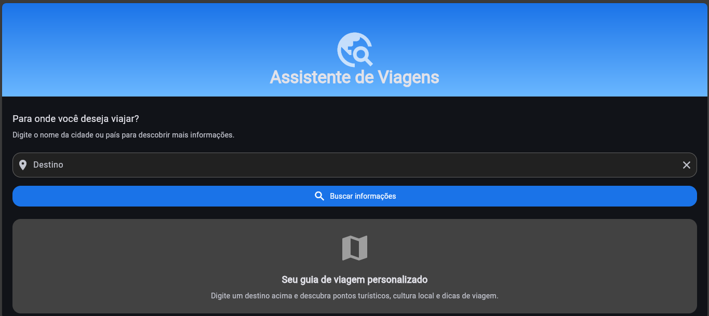
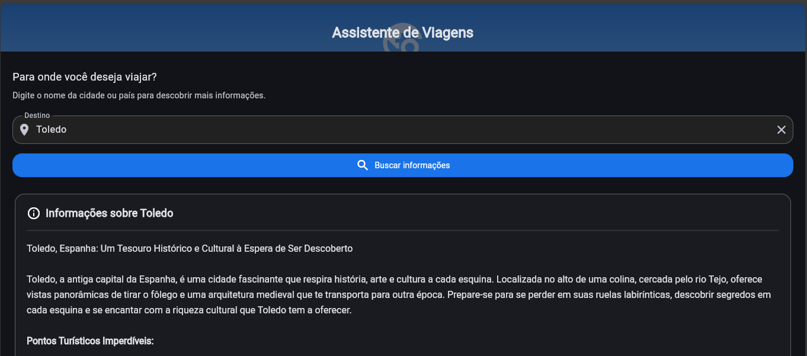

## 🌎 Assistente de Viagens

**Autor:** Paola Julie dos Santos da Silva


## 📱 Descrição

O Assistente de Viagens é um aplicativo mobile desenvolvido com Flutter que integra inteligência artificial generativa para oferecer informações ricas e personalizadas sobre destinos turísticos.
Com ele, os usuários podem explorar dados sobre pontos turísticos, cultura local e receber dicas valiosas de viagem, tornando o planejamento de suas aventuras muito mais prático e interativo.
Este projeto foi desenvolvido como parte das atividades da disciplina de Desenvolvimento de Dispositivos Móveis II.

## 📷 Demonstração

    


## ✨ Funcionalidades

- Interface limpa e intuitiva com design Material 3  
- Consulta de destinos turísticos em tempo real  
- Exibição formatada de resultados com suporte a markdown  


## 🛠️ Tecnologias Utilizadas

- **Flutter & Dart**: Framework para desenvolvimento multiplataforma  
- **Material 3**: Design system para interfaces modernas  
- **API de IA Generativa**: Utilizada para gerar informações detalhadas sobre destinos  
- **Markdown Formatter**: Processamento e formatação de texto avançado  


## 🤖 Utilização de LLM (Large Language Model)

Este projeto utiliza um **modelo de linguagem grande (LLM)** para gerar informações detalhadas sobre **destinos turísticos**.

O aplicativo envia **prompts específicos** para a API de IA, solicitando dados sobre:

- Pontos turísticos  
- Cultura local  
- Dicas de viagem

A lógica de conexão com a API está implementada no arquivo `travel_service.dart`, que gerencia as requisições e formata as respostas para exibição no aplicativo.

## ⚙️ Instalação e Execução

### Pré-requisitos

- Flutter SDK (versão 3.0.0 ou superior)  
- Dart SDK  
- Android Studio ou VSCode com extensões Flutter/Dart  
- Emulador ou dispositivo físico para teste  

### Passos para instalação

Clone o repositório:

```bash
git clone https://github.com/seu-usuario/assistente-viagens.git
cd assistente-viagens

Instale as dependências:

```bash
flutter pub get

Adicione sua chave API no arquivo travel_service.dart

Execute o aplicativo:

bash
flutter run


